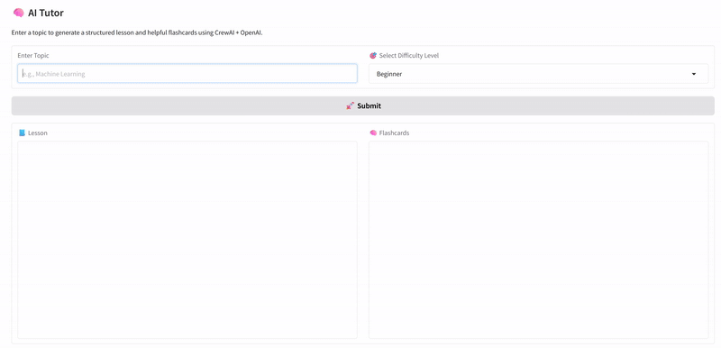

<p align="center">
  
</p>


**AI Tutor**

This project delivers an intelligent, interactive learning assistant capable of generating adaptive lessons and flashcards on any topic. Leveraging CrewAI’s multi-agent framework and OpenAI’s advanced language models, the complete notebook showcases an end-to-end workflow for automated, personalized education. The system begins by accepting a topic and desired difficulty level, proceeds through collaborative lesson planning and generation, and presents structured educational content alongside targeted flashcards. The objective is to create a scalable, general-purpose AI tutor that makes learning accessible and engaging for users of all backgrounds.

**Overview**

Navigating new subjects can be challenging without personalized guidance. This project addresses that gap by orchestrating AI agents to break down complex topics into manageable subtopics, generate well-structured lessons, and produce supportive flashcards, all tailored to the learner’s chosen level, from beginner to advanced. The AI Learning Tutor is designed to be widely applicable, serving self-learners, educators, and organizations seeking flexible, on-demand educational content across disciplines.

**Getting Started**

To run this project, clone or download the repository to your local machine. Ensure you have Python 3.9 or later, then install all required dependencies using the included requirements.txt file:

```sh
pip install -r requirements.txt
```

Next, obtain an OpenAI API key and configure it as an environment variable (see the notebook instructions for secure setup, especially if using Google Colab). Launch the notebook or script, and you will be prompted to enter a topic and select a difficulty level. The application will then generate a customized lesson and set of flashcards, displayed through a user-friendly Gradio interface.

**Project Workflow**

The workflow begins with user input, capturing the desired topic and learning level. CrewAI agents collaborate to decompose the topic, design an adaptive lesson plan, and write clear, detailed explanations. The lesson output includes sections for title, definition, examples, analogies, and summary, while the flashcard module generates three focused Q\&A pairs to reinforce learning. The entire process is automated, ensuring consistency and adaptability across diverse subject areas.

**Key Features & Techniques**

Key features of the AI Learning Tutor include adaptive difficulty selection, multi-agent coordination for lesson generation, and an interactive Gradio web interface. The system is designed for scalability and generalization, capable of addressing any topic supported by the underlying language model. Output formatting is enforced for readability, and lessons are structured for optimal educational value, regardless of the user’s background.

**Results**

The AI Learning Tutor reliably generates coherent, well-organized lessons and practical flashcards tailored to user preferences. User testing demonstrates that the adaptive difficulty system provides suitable challenge and clarity for beginners, intermediates, and advanced learners alike. The platform’s versatility makes it valuable for self-study, classroom augmentation, and corporate training.

<p align="center">
  
</p>

**Contact**

For questions, feedback, or collaboration inquiries, please connect via [LinkedIn](https://www.linkedin.com/in/hamihekmati-399932154/) or by opening an issue in this repository. This project was developed by Hami Hekmati as part of a data science, AI portfolio, with the goal of advancing accessible and adaptive learning solutions.
